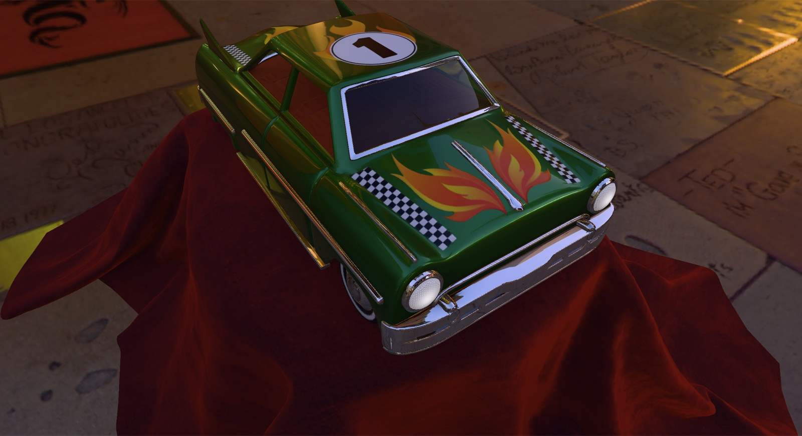
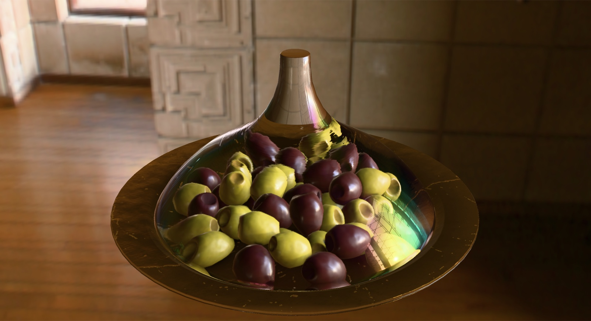

# speedo

speedo is a real-time 3D renderer and asset viewer built on Vulkan. Open a glTF or OBJ model, a zip archive of models,
an HDR environment or an image, and fly around it: materials, lights, shadows, transparency and animation are drawn as
the glTF spec and the Khronos sample viewer describe them. It is also a playground for engine architecture: a task
system, a frame graph, a graphics abstraction layer and a client/server split.

It runs on macOS (Apple Silicon, through KosmicKrisp or MoltenVK), Windows and Linux, and builds with clang everywhere.





*Khronos glTF sample models ToyCar and IridescentDishWithOlives, through their own cameras, lit by the footprint_court
and ennis panoramas from glTF-Sample-Environments.*

## What's in the box

| Program     | What it does |
|-------------|--------------|
| `client`    | The viewer. A window with a menu bar, one or more views of the loaded scene, and tools for inspecting it. |
| `server`    | A small companion process the client talks to over ZeroMQ. It is the start of a distributed task system and does little yet. |
| `assettest` | A command line tool that imports every model, image and environment it's given and checks the results. It's the main automated test. |
| `filebench` | A benchmark of the ways to read a file (std streams, stdio, memory mapping), warm and cold, of the importers (`--import <files>`) and of zip extraction (`--zip <archives>`). |

### Using the client

- **File > Open File...** loads models (`.gltf`, `.glb`, `.obj`), zip archives of models, environments (`.hdr`) and
  images. **Open Folder...** loads all of a folder's models side by side.
- **Moving around:** hold the left mouse button and drag to look around, use `W`/`A`/`S`/`D` to move, and the scroll
  wheel to change the move speed. `Alt+Enter` toggles fullscreen.
- **View** is where most of the settings live:
  - the views layout
  - the environment: the procedural sky or a panorama, its rotation and intensity, and its dominant lights
  - the glTF scene, animation and camera
  - exposure and tonemapping
  - shadows
  - FPS and statistics, including GPU timings per render pass
- By default the views start on the model's first camera, or framed on the model if it has none.

### What it renders

- **Models:**
  - glTF 2.0, including compressed meshes (Draco, meshopt) and compressed textures (KTX2/Basis, WebP)
  - Wavefront OBJ with MTL materials
- **Materials:** metallic-roughness, specular-glossiness and unlit, plus every `KHR_materials_*` extension used by the
  Khronos sample models: clearcoat, sheen, transmission, volume, iridescence, anisotropy and more.
- **Lighting:**
  - image based lighting from the environment
  - glTF punctual lights, plus the environment's strongest light sources as directional lights
  - shadow maps for all of them
- **Transparency:** exact, order independent.
- **Animation:** skins, morph targets, node animations and `KHR_animation_pointer`.

## Getting started

### 1. Set up the machine

Run the bootstrap script for your platform from the repository root:

| Platform | Command |
|----------|---------|
| macOS    | `./setup_osx.sh` |
| Linux    | `./setup_linux.sh` |
| Windows  | `setup_windows.bat` |

The bootstrap script installs PowerShell 7.5+ if it's missing, then hands over to `setup.ps1`, which:

- installs the system packages: Homebrew, apt or winget, plus Visual Studio on Windows, and on macOS the Vulkan drivers
  (`mesa` for KosmicKrisp and `molten-vk`)
- bootstraps the `vcpkg` submodule
- generates `CMakeUserPresets.json` and the VS Code launch and task configurations

Re-run `setup.ps1` after OS or SDK updates; it notices them and clears stale CMake caches.

The first configure builds every dependency through vcpkg, including the LLVM toolchain itself, so expect it to take a
long time. Later configures restore packages from vcpkg's binary cache.

### 2. Configure and build

Every build directory comes from a preset named `<triplet>-<config>`, for example `arm64-osx-clang-debug`. There are
three configs:

| Config    | Use it for |
|-----------|------------|
| `debug`   | Day-to-day debugging. Vulkan validation layers and asserts are on, and it's slow. |
| `profile` | Optimized, with profiling (Tracy and GPU pass timings) and asserts. The best default for testing. |
| `release` | Optimized, without profiling. |

```sh
cmake --preset arm64-osx-clang-profile
cmake --build build/arm64-osx-clang-profile
```

Always configure with `cmake --preset <name>` before building from a shell; don't copy raw `cmake` commands out of an
IDE log. The presets carry the toolchain environment, and without it the build fails in confusing ways. CLAUDE.md
explains why.

In VS Code, the CMake Tools extension picks up the presets, and the generated launch configurations start the client,
the server or the Tracy profiler with the right environment.

### 3. Run

Run the programs from the repository root:

```sh
./build/arm64-osx-clang-profile/client
```

| Option | Default |
|--------|---------|
| `-r <dir>`: the resource directory (fonts, shaders, test assets) | `resources/` |
| `-u <dir>`: the user profile directory (settings, the asset and pipeline caches, logs) | `.speedo/` |

On macOS, point the Vulkan loader at a driver, for example KosmicKrisp:

```sh
export VK_DRIVER_FILES=$(brew --prefix mesa)/share/vulkan/icd.d/kosmickrisp_mesa_icd.aarch64.json
```

For a debug build from a shell, also set `VK_LAYER_PATH=$PWD/install/<triplet>/share/vulkan/explicit_layer.d` so the
validation layers are found. The VS Code launch configurations set both.

## Testing

### Test assets

The test sets are downloaded from their original sources rather than kept in the repository. This command fetches
everything into `resources/test-assets/` (gitignored), or into `$SPEEDO_TEST_ASSETS` if that is set:

```sh
pwsh scripts/fetch-test-assets.ps1
```

- **Morgan McGuire's Computer Graphics Archive:** OBJ scenes, about 2.7 GB
- **The Khronos glTF-Sample-Assets models:** about 2.3 GB
- **The Khronos glTF-Sample-Environments panoramas:** about 400 MB

Downloads are pinned to a commit or checked against the checksums in `scripts/test-assets/`. Re-running the script
only fetches what's missing or changed. It prints the paths to test, which also include the hand-made models in
`scripts/test-assets/` for cases no downloaded asset covers.

### The asset regression

`scripts/assettest.ps1` is the main test suite. Given zip archives or directories, it runs `assettest` over every
model, image and environment in them. `assettest` checks index ranges, normals, winding, textures, mip chains,
compression error, environment prefiltering and more. With `-Client`, the script also opens each model in the client
and fails on load errors, asserts and validation messages.

From pwsh:

```powershell
scripts/assettest.ps1 -Client -Preset arm64-osx-clang-profile -Work <work dir> (scripts/fetch-test-assets.ps1)
```

From another shell:

```sh
pwsh scripts/assettest.ps1 -Client -Preset arm64-osx-clang-profile -Work <work dir> $(pwsh scripts/fetch-test-assets.ps1)
```

- **The work directory** holds the extracted archives and the asset caches. Reuse it between runs: the first run
  imports everything and is slow, later runs are much faster.
- **The full regression:** run the `profile` preset first, then `debug` with `-ClientOnly` and the same `-Work`
  directory. Validation only runs in debug, which imports slowly, so it reuses the caches profile filled.
- **Background windows:** the client windows it opens stay behind your other windows and don't take focus, so you can
  keep working while it runs.
- **Results:** each group of checks ends in a pass/warn/fail summary. Warnings are known problems in the source assets.
  Failures and client asserts are regressions.

### Driving the client from scripts

Environment variables let you start the client in a known state, which is handy for reproducing bugs and taking
screenshots:

| Variable | Effect |
|----------|--------|
| `SPEEDO_AUTOLOAD_MODEL`, `SPEEDO_AUTOLOAD_IMAGE`, `SPEEDO_AUTOLOAD_ENVIRONMENT` | Load these files at startup (absolute, or relative to the resource directory). |
| `SPEEDO_AUTOLOAD_EXIT=<frames>` | Exit that many frames after the loads finish. |
| `SPEEDO_BACKGROUND=1` | Open the window behind the others, without taking focus. |
| `SPEEDO_ANIMATION_TIME=<seconds>` | Freeze animations at a fixed time. |
| `SPEEDO_TONEMAPPER`, `SPEEDO_AUTO_EXPOSURE`, `SPEEDO_SHADOWS`, `SPEEDO_ENVIRONMENT_ROTATION`, `SPEEDO_ENVIRONMENT_INTENSITY` | Start with these view settings. |
| `SPEEDO_GPU_TIMINGS=1` | Print each render pass's median GPU time at exit (debug and profile builds). |
| `SPEEDO_VALIDATE_SYNC=1` | Enable Vulkan synchronization validation (debug builds). |

## Profiling

Debug and profile builds are instrumented with [Tracy](https://github.com/wolfpld/tracy). Start the Tracy profiler from
`install/<triplet>/tools/tracy/` or from its VS Code launch configuration, then run the client. The client's Statistics
window also shows GPU time per render pass, the frame graph's memory, and counts of live GPU objects.

## Repository layout

| Path | Contents |
|------|----------|
| `src/core` | Foundations: the task executor, futures, memory pools, file and path helpers, the application base class. |
| `src/platform` | The window system: windows, the windowed application base (its main loop's work, exit wake-ups), file dialogs, imgui's platform side. |
| `src/rhi` | The graphics abstraction over Vulkan: devices, queues, command buffers, buffers, images, pipelines, the swapchain. |
| `src/gfx` | Everything above the rhi: importers, models, textures, environments, cameras and views, the frame graph and renderer, the shaders (`src/gfx/shaders`, Slang), and the windowed application. |
| `src/client`, `src/server` | The two programs. |
| `src/tools` | `assettest`. |
| `scripts/` | Setup, test and asset scripts, CMake toolchains and vcpkg triplets. Scripts are PowerShell, run with `pwsh` on every platform. |
| `ports/` | vcpkg overlay ports: patched versions of dependencies. |
| `resources/` | Fonts and other runtime resources; test assets are downloaded here. |
| `TODO.md` | What's planned, in progress and done. |
| `CLAUDE.md` | Detailed engineering notes: the architecture's rules, conventions, and the causes of past build and runtime failures. Read it before changing the rhi, the build or the toolchain. |
